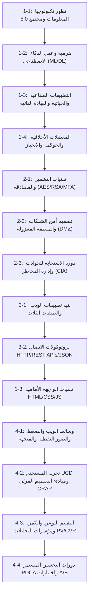

# تقرير التحليل المرجعي والشامل لمنهج وزارة التربية والتعليم المصرية
## البرمجة والذكاء الاصطناعي — الصف الثاني الثانوي (الفصل الدراسي الأول)
### The Authoritative Reference Blueprint for CodeK Curriculum Redesign

---

# 1. Executive Summary (الملخص التنفيذي)

* **ما هو هذا المنهج؟**
  هذا المنهج هو الكتاب الوزاري الرسمي المعتمد من **وزارة التربية والتعليم والتعليم الفني المصرية** تحت عنوان **"البرمجة والذكاء الاصطناعي" (Programming and Artificial Intelligence)**، والمطور بالشراكة مع بيوت خبرة تعليمية دولية في إطار **رؤية مصر 2030**.
* **المرحلة الدراسية والفصل المستهدف:**
  **الصف الثاني الثانوي (Grade 11 - Secondary 2) — الفصل الدراسي الأول (Term 1)**.
* **الموضوعات والمجالات المعرفية الرئيسية:**
  يغطي منهج الترم الأول أربعة مجالات هندسية وتقنية متكاملة موزعة عبر أربعة فصول رئيسية:
  1. **تكنولوجيا المعلومات والمجتمع والذكاء الاصطناعي (Information Technology, Society & AI):** التطور التاريخي للحوسبة، قانون مور، بنية مجتمع المعلومات (Society 5.0)، آلية عمل الذكاء الاصطناعي (AI vs ML vs DL vs GenAI)، استخراج الخصائص والشبكات العصبية، تطبيقات الذكاء الاصطناعي في الصناعة والرعاية الصحية والنقل (القيادة الذاتية)، والقضايا الأخلاقية والحوكمة والانحياز والملكية الفكرية والتزييف العميق.
  2. **الأمن السيبراني (Cybersecurity):** ركائز التشفير المتماثل وغير المتماثل، دوال الهاش والتجزئة، التوقيع والشهادات الرقمية، المصادقة متعددة العوامل (MFA)، التصميم الآمن للشبكات وبنية المنطقة المعزولة (DMZ)، جدران الحماية (Firewalls)، أنظمة كشف ومنع التسلل (IDS/IPS)، نموذج انعدام الثقة (Zero Trust)، ودورة حياة الاستجابة للحوادث الأمنية (Incident Response Lifecycle) وإدارة المخاطر وثالوث أمن المعلومات (CIA Triad).
  3. **هندسة وتطبيقات الويب (Web Application Engineering):** بنية العميل/الخادم (Client-Server)، نموذج الطبقات الثلاث (Three-Tier Architecture: Presentation, Application, Data)، بروتوكولات الاتصال (HTTP/HTTPS)، دورة الطلب والاستجابة (Request/Response Cycle)، أفعال HTTP ورموز الحالة (Status Codes)، واجهات البرمجة (REST APIs) وتبادل البيانات بصيغة JSON، والتقنيات الأساسية للواجهة الأمامية (HTML5 الدلالية، CSS3 والتصميم المتجاوب، JavaScript للتفاعل والـ DOM).
  4. **تصميم الويب وهندسة الوسائط وتجربة المستخدم (Web Design, Media & UX):** معالجة وخصائص الوسائط الرقمية (الصور النقطية Raster مقابل المتجهة Vector، خوارزميات الضغط بفقد وبدون فقد Lossy vs Lossless)، التصميم المتمحور حول المستخدم (UCD) وبناء شخصيات المستخدمين (Personas) والمخططات الهيكلية (Wireframes)، المبادئ الأربعة للتصميم المرئي (CRAP: التباين، التكرار، المحاذاة، التقارب)، أساليب تقييم المواقع (التقييم النوعي مقابل التحليلات الكمية مثل PV, Bounce Rate, CVR)، والتحسين التكراري المستمر باستخدام دورة PDCA واختبارات أ/ب (A/B Testing).
* **التدرج التعليمي العام (Learning Progression):**
  يبدأ المنهج من **السياق المجتمعي والتاريخي** لاستيعاب كيف وصلنا للذكاء الاصطناعي $\rightarrow$ ينتقل إلى **العمق التقني والأخلاقي للذكاء الاصطناعي** $\rightarrow$ يؤسس **الدرع الأمني السيبراني** اللازم لأي منظومة تقنية $\rightarrow$ ينتقل إلى **بناء وهندسة تطبيقات الويب (Architecture & Protocols)** $\rightarrow$ يتوج ذلك بـ **التصميم المرئي، تجربة المستخدم، والتقييم والتحسين المستمر القائم على البيانات**.
* **طبيعة البرمجة في الجزء الأول:**
  **حقيقة موثقة من المستند:** لا يحتوي الترم الأول على تدريس خوارزميات برمجية تفصيلية بلغة عامة مثل بايثون (المتوقع تأجيلها للجزء الثاني/الترم الثاني)، بل يركز تركيزاً هندسياً مكثفاً على **بنية الأنظمة البرمجية (Software & Web Architecture)**، بروتوكولات تبادل البيانات (HTTP/APIs/JSON)، وتقنيات الويب الثلاثية (HTML/CSS/JS) ومفاهيم الواجهة والخلفية وقواعد البيانات.

---

# 2. Exact Curriculum Structure (هيكل المنهج الدقيق)

يتبع الكتاب المدرسي تنظيماً هرمياً صارماً ومنهجياً موحداً عبر جميع فصوله:

### 1. التقسيم الكلي للمحتوى
* **عدد الفصول (Chapters):** 4 فصول رئيسية.
* **عدد الدروس (Lessons):** **14 درساً** تحديداً (مرقمة رسمياً من 1-1 وحتى 4-4).
* **عدد الصفحات الفعلية في الكتاب:** من صفحة 4 إلى صفحة 95.

### 2. التشريح البيداغوجي الموحد لكل درس (Pedagogical Anatomy of a Lesson)
كل درس من الدروس الـ 14 يتكون بدقة متناهية من 14 قسماً تعليمياً ثابتاً:
1. **عنوان الدرس ورقمه الرسمي** (مثال: `تطور تكنولوجيا المعلومات والتحول الاجتماعي — 1-1`).
2. **خريطة الدرس ⭐ (Lesson Map):** تتضمن:
   - *الفكرة الأساسية (Key Idea):* الجملة المفتاحية للدرس.
   - *المفاهيم الأساسية (Core Concepts):* قائمة المصطلحات التقنية الأساسية.
   - *مقدمة سياقية وسيناريو واقعي.*
3. **السؤال الرئيسي (Main Driving Question):** السؤال التوجيهي المحوري الذي يدور حوله الدرس.
4. **مسار التعلم ↻ (ATL - Approaches to Learning):** يحدد السياق (Context)، المحتوى (Content)، المفهوم (Concept)، ومهارات التفكير والبحث.
5. **استكشف (في ثنائيات) ✎ (Pair Exploration Activity):** نشاط تعاوني تفاعلي تمهيدي لكسر الجليد واستكشاف المفهوم قبل القراءة.
6. **ملحوظة مهمة 📌 (Core Theoretical & Conceptual Content):** المتن النظري والعلمي للدرس، مقسماً إلى بنود فرعية مرقمة، مدعوماً بجداول، مخططات تدفق، وأشكال هندسية توضيحية.
7. **الفكرة الرئيسة (Key Concept Synthesis):** تلخيص مكثف لمغزى المحتوى.
8. **سؤال على نمط الامتحان 📝 (Exam-Style Question):** سؤال معياري يحاكي امتحانات الثانوية العامة مع تقديم **الحل النموذجي المكتمل والمفصل (الحل ✓)**.
9. **توقف وفكّر 💡 (Reflection Prompt):** سؤال تفكير نقدي عميق يدفع الطالب لربط المفاهيم وتفسير الأسباب الهندسية.
10. **فكّر كمهندس: ابحث ثم قرر ⚙ (Engineering Inquiry Activity):** نشاط عملي تطبيقي يضع الطالب في موقع مهندس برمجيات/نظم عليه دراسة سيناريو واقعي واتخاذ قرارات هندسية مبررة.
11. **طبّق ما تعلمته 🌍 (Real-World Application Task):** مهمة عملية تربط ما تعلمه الطالب بمشكلات وتطبيقات حقيقية في البيئة المصرية والعالمية.
12. **إجابة السؤال الرئيسي ❓ (Model Answer to Driving Question):** إجابة نموذجية جامعة على السؤال الرئيسي الذي بدأ به الدرس.
13. **فكّر وتحدَّ نفسك ⭐ (Advanced Challenge Problem):** مسألة أو سيناريو متقدم يختبر المستويات العليا من التفكير والتحليل.
14. **تدرّب / تمارين (Practice & Exercises):** مجموعة تقييمية ختامية تشمل أسئلة "اختبر فهمك دون الرجوع للملحوظة المهمة"، أسئلة الاختيار من متعدد، ملء الفراغات، وأسئلة مقالية تحليلية، يليها **الخلاصة ⭐**.

---

# 3. Complete Curriculum Inventory (الجرد الشامل للمنهج)

فيما يلي الجرد التفصيلي الكامل لجميع فصول ودروس المنهج الـ 14 دون استثناء:

```
الفصل 1: تكنولوجيا المعلومات والمجتمع (4 دروس)
├── 1-1: تطور تكنولوجيا المعلومات والتحول الاجتماعي
├── 1-2: كيف يعمل الذكاء الاصطناعي
├── 1-3: الذكاء الاصطناعي في الحياة اليومية والصناعة
└── 1-4: القضايا الأخلاقية المتعلقة بالذكاء الاصطناعي

الفصل 2: الأمن السيبراني (3 دروس)
├── 2-1: تقنيات التشفير والمصادقة
├── 2-2: تصميم أمن الشبكات
└── 2-3: الاستجابة للحوادث وإدارة المخاطر

الفصل 3: تطبيقات الويب (3 دروس)
├── 3-1: البنية العامة لتطبيقات الويب
├── 3-2: طرق الاتصال في تطبيقات الويب
└── 3-3: أساسيات تقنية الواجهة الأمامية

الفصل 4: تصميم الويب والوسائط (4 دروس)
├── 4-1: أنواع الوسائط وخصائصها
├── 4-2: تصميم المعلومات وتجربة المستخدم للمواقع
├── 4-3: أساليب تقييم المواقع الإلكترونية
└── 4-4: عملية التحسين التكراري للمواقع
```

---

## الفصل الأول: تكنولوجيا المعلومات والمجتمع (Information Technology and Society)
* **العنوان الرسمي بالعربية:** تكنولوجيا المعلومات والمجتمع
* **نطاق الصفحات:** 4 – 30
* **الهدف:** تأسيس فهم الطلاب لتاريخ الحوسبة، أثر تكنولوجيا المعلومات على المجتمع والتحول نحو المجتمع فائق الذكاء، البنية الرياضية والمفاهيمية للذكاء الاصطناعي وتعلم الآلة، وتطبيقاته الصناعية والحياتية، والتحديات الأخلاقية والقانونية للحوكمة والانحياز والتزييف الرقمي.
* **عدد الدروس:** 4 دروس.

### الدرس 1-1: تطور تكنولوجيا المعلومات والتحول الاجتماعي
* **العنوان الرسمي:** تطور تكنولوجيا المعلومات والتحول الاجتماعي (Evolution of IT & Social Transformation)
* **المفاهيم الأساسية:** قانون مور (Moore's Law)، شبكات التواصل الاجتماعي (SNS)، التجارة الإلكترونية (E-Commerce)، العمل والتعلم عن بعد، الدفع غير النقدي (Cashless Payments)، الحوسبة السحابية (Cloud Computing)، الحوسبة الطرفية (Edge Computing)، السيارات ذاتية القيادة، الواقع المعزز/الافتراضي (AR/VR)، الحوسبة الكمومية (Quantum Computing).
* **الموضوعات الفرعية:**
  1. تاريخ أجيال الحواسيب (الصمامات المفرغة، الترانزستور، الدوائر المتكاملة، المعالجات الدقيقة، الإنترنت، الهواتف الذكية).
  2. قانون مور ومضاعفة الترانزستورات كل عامين وتراجع التكلفة وزيادة القوة الحاسوبية.
  3. تطور المجتمعات (الصيد $\rightarrow$ الزراعة $\rightarrow$ الصناعة $\rightarrow$ مجتمع المعلومات 4.0 $\rightarrow$ المجتمع الفائق الذكاء 5.0).
  4. الحوسبة الطرفية مقابل الحوسبة السحابية وحل مشكلة زمن الاستجابة (Latency).
* **الأنشطة والمهام:**
  - *استكشف:* مقارنة الحقب الزمنية التكنولوجية.
  - *توقف وفكر:* لماذا تفضل الحوسبة الطرفية في معالجة بيانات كاميرات السيارات ذاتية القيادة؟
  - *سؤال نمط الامتحان:* مقارنة معيارية بين الحوسبة السحابية والحوسبة الطرفية من حيث مكان المعالجة وزمن الاستجابة.
  - *فكر كمهندس:* اتخاذ قرار بشأن البنية الحاسوبية لمستشفى ذكي وسيارات إسعاف متصلة.
  - *طبق ما تعلمته:* استقصاء خدمات الدفع غير النقدي والتحول الرقمي في مصر.
* **مخرجات التعلم المتوقعة:** أن يشرح الطالب كيف غيرت تقنيات الحوسبة بنية المجتمع، ويقارن بين الحوسبة السحابية والطرفية ويفسر سبب الحاجة لكل منهما.

### الدرس 1-2: كيف يعمل الذكاء الاصطناعي
* **العنوان الرسمي:** كيف يعمل الذكاء الاصطناعي (How Artificial Intelligence Works)
* **المفاهيم الأساسية:** الذكاء الاصطناعي (AI)، تعلم الآلة (Machine Learning - ML)، التعلم العميق (Deep Learning - DL)، الذكاء الاصطناعي التوليدي (Generative AI - GenAI)، استخراج الخصائص (Feature Extraction)، الشبكات العصبية الاصطناعية (Artificial Neural Networks)، بيانات التدريب والخوارزميات (Training Data & Algorithms).
* **الموضوعات الفرعية:**
  1. العلاقة الهرمية المتقاطعة (AI $\supset$ ML $\supset$ DL $\supset$ GenAI).
  2. الفرق الجوهري بين البرمجة القائمة على القواعد الثابتة (Rule-based) وتعلم الآلة القائم على استنباط الأنماط من البيانات.
  3. استخراج الخصائص اليدوي في ML مقابل الاستخراج التلقائي متعدد الطبقات في DL.
  4. آلية عمل الخلايا العصبية الاصطناعية وتمرير الأوزان والانحيازات (Weights & Biases).
* **الأنشطة والمهام:**
  - *استكشف:* تصنيف مهام يومية إلى مهام تتبع قواعد صلبة وأخرى تتطلب نماذج تعلم آلي.
  - *توقف وفكر:* لماذا يحتاج التعلم العميق إلى عتاد حاسوبي قوي وبيانات ضخمة؟
  - *سؤال نمط الامتحان:* تحديد الفروق الفنية بين تعلم الآلة التقليدي والتعلم العميق في استخراج الميزات.
  - *فكر كمهندس:* تصميم نظام ذكاء اصطناعي لفرز وتصنيف النفايات والمخلفات المدرسية.
  - *طبق ما تعلمته:* فحص تطبيقات التعرف على الوجوه أو تحليل الصوت في الأجهزة الشخصية.
* **مخرجات التعلم:** أن يحدد الطالب الهيكل الهرمي للذكاء الاصطناعي، ويوضح كيفية عمل الشبكات العصبية ودور استخراج الخصائص التلقائي.

### الدرس 1-3: الذكاء الاصطناعي في الحياة اليومية والصناعة
* **العنوان الرسمي:** الذكاء الاصطناعي في الحياة اليومية والصناعة (AI in Daily Life and Industry)
* **المفاهيم الأساسية:** الرعاية الصحية، تشخيص الأورام بالأشعة، مستويات القيادة الذاتية (Levels 0-5)، الصيانة التنبؤية (Predictive Maintenance)، معالجة اللغات الطبيعية (NLP)، رؤية الحاسوب (Computer Vision)، أنظمة التوصية (Recommendation Engines).
* **الموضوعات الفرعية:**
  1. تطبيقات الذكاء الاصطناعي الطبية (تحليل الصور الطبية واكتشاف الجزيئات الدوائية).
  2. مستويات أتمتة القيادة الذاتية من مساعدة السائق حتى القيادة الكاملة بدون سائق، وأجهزة الاستشعار (كاميرات، رادار، ليدار).
  3. الذكاء الاصطناعي في المصانع والصيانة التنبؤية عبر تحليل بيانات الحساسات وتجنب التوقف المفاجئ.
  4. محركات التوصية في المنصات التجارية وخدمات الفيديو وروبوتات الدعم الذكية.
* **الأنشطة والمهام:**
  - *استكشف:* تتبع 5 خدمات تفاعلية يومية تعتمد على الذكاء الاصطناعي.
  - *توقف وفكر:* ما الفرق الجوهري بين المستوى 2 (مساعدة توجيه وتسارع مع يقظة تامة للسائق) والمستوى 4 (قيادة ذاتية كاملة في بيئات محددة)؟
  - *سؤال نمط الامتحان:* حساب وفهم فوائد الصيانة التنبؤية مقابل الصيانة الوقائية والطارئة.
  - *فكر كمهندس:* تخطيط إدخال الذكاء الاصطناعي في منظومة عيادات طبية لتحسين الفرز والاستجابة للطوارئ.
  - *طبق ما تعلمته:* تحليل محرك التوصيات في المتاجر الإلكترونية الشهيرة.
* **مخرجات التعلم:** أن يعدد الطالب تطبيقات الذكاء الاصطناعي في قطاعات الرعاية والصناعة والنقل، ويفسر مستويات القيادة الذاتية ومنطق الصيانة التنبؤية.

### الدرس 1-4: القضايا الأخلاقية المتعلقة بالذكاء الاصطناعي
* **العنوان الرسمي:** القضايا الأخلاقية المتعلقة بالذكاء الاصطناعي (Ethical Issues of Artificial Intelligence)
* **المفاهيم الأساسية:** الانحياز الخوارزمي (Algorithmic Bias)، خصوصية البيانات (Data Privacy)، حقوق الملكية الفكرية للمحتوى التوليدي، التزييف العميق (Deepfakes)، صندوق الذكاء الاصطناعي الأسود والقابلية للتفسير (Explainability/Black Box)، الرقابة البشرية المشرفة (Human-in-the-Loop).
* **الموضوعات الفرعية:**
  1. أسباب الانحياز: بيانات التدريب غير المتوازنة أو الحاملة لانحيازات بشرية سابقة وتأثيرها على قرارات التوظيف والقروض.
  2. مخاطر انتهاك الخصوصية وحق الأفراد في حماية بياناتهم الرقمية وموافقتهم المستنيرة.
  3. قضايا الملكية الفكرية وتدريب النماذج التوليدية على أعمال الفنانين والكتاب دون إذن أو نسب.
  4. تزييف الوسائط بالفيديو والصوت (Deepfake) واستغلاله في التضليل والاحتيال وطرق رصده تقنياً.
  5. ميثاق الذكاء الاصطناعي الأخلاقي: العدالة، الشفافية، المساءلة، والأمان.
* **الأنشطة والمهام:**
  - *استكشف:* مناقشة حالة شركة تستخدم خوارزمية فرز سير ذاتية تستبعد فئات معينة.
  - *توقف وفكر:* كيف يمكن لنظام تدرب على بيانات تاريخية صادقة أن يعيد إنتاج الظلم؟
  - *سؤال نمط الامتحان:* تحليل سيناريو انحياز خوارزمي وتحديد الآليات الوقائية لعلاجه وتطبيق مبدأ Human-in-the-Loop.
  - *فكر كمهندس:* صياغة سياسة استخدام أخلاقي لأداة ذكاء اصطناعي داخل مؤسسة تعليمية.
  - *طبق ما تعلمته:* تقييم فيديو مشتبه في كونه تزييفاً عميقاً واستخدام علامات التحقق البصرية والصوتية.
* **مخرجات التعلم:** أن يحلل الطالب معضلات الانحياز والخصوصية والملكية الفكرية، ويقترح حلولاً تضمن الشفافية والمسؤولية الإنسانية.

---

## الفصل الثاني: الأمن السيبراني (Cybersecurity)
* **العنوان الرسمي:** الأمن السيبراني
* **نطاق الصفحات:** 31 – 49
* **الهدف:** بناء المعرفة التأسيسية بأمن المعلومات، خوارزميات التشفير والمصادقة، تصميم الشبكات الآمنة، وهندسة الدفاع متعدد الطبقات، وإدارة المخاطر والاستجابة للحوادث وفق الأطر المعيارية العالمية.
* **عدد الدروس:** 3 دروس.

### الدرس 2-1: تقنيات التشفير والمصادقة
* **العنوان الرسمي:** تقنيات التشفير والمصادقة (Encryption & Authentication Technologies)
* **المفاهيم الأساسية:** التشفير المتماثل (Symmetric Encryption - AES)، التشفير غير المتماثل (Asymmetric Encryption - RSA/ECC)، المفتاح العام والمفتاح الخاص (Public & Private Keys)، دوال التجزئة الرياضية (Hash Functions - SHA-256)، التوقيع الرقمي (Digital Signature)، الشهادات الرقمية وبروتوكول HTTPS/TLS، المصادقة متعددة العوامل (MFA/2FA)، القياسات الحيوية (Biometrics).
* **الموضوعات الفرعية:**
  1. التشفير المتماثل: استخدام مفتاح سري واحد، سرعته الفائقة، ومعضلة توزيع المفتاح.
  2. التشفير غير المتماثل: زوج المفاتيح (العام للتشفير، والخاص لفك التشفير)، حل معضلة التوزيع، واستخدامه الهجين مع المتماثل في اتصالات الويب.
  3. دوال الهاش أحادية الاتجاه (One-way): التحقق من سلامة الملفات (Integrity) وتخزين كلمات المرور.
  4. التوقيع الرقمي لمنع الإنكار والتحقق من الهوية، والشهادات الرقمية الصادرة عن جهات معتمدة (CA).
  5. عوامل المصادقة الثلاثة: شيء تعرفه (كلمة المرور)، شيء تملكه (رمز الهاتف/المفتاح الأمني)، شيء أنت عليه (بصمة الإصبع/الوجه).
* **الأنشطة والمهام:**
  - *استكشف:* تجربة تبادل رسائل مشفرة ومناقشة ثغرات المفتاح المشترك.
  - *توقف وفكر:* لماذا يعتمد بروتوكول HTTPS على التشفير غير المتماثل في بداية الاتصال (Handshake) ثم يكمل الجلسة بتشفير متماثل؟
  - *سؤال نمط الامتحان:* مسألة حول كيفية عمل التوقيع الرقمي باستخدام المفتاح الخاص والهاش والتحقق منه بالمفتاح العام.
  - *فكر كمهندس:* تصميم نظام مصادقة متعدد العوامل لتطبيق مصرفي يوازن بين الحماية وسهولة الاستخدام.
  - *طبق ما تعلمته:* فحص شهادة الأمان (SSL/TLS Certificate) لموقع في المتصفح والتحقق من صلاحيتها وجهة الإصدار.
* **مخرجات التعلم:** أن يميز الطالب بين التشفير المتماثل وغير المتماثل، ويشرح دور دوال الهاش والتوقيع الرقمي، ويصمم خطة مصادقة قوية.

### الدرس 2-2: تصميم أمن الشبكات
* **العنوان الرسمي:** تصميم أمن الشبكات (Network Security Design)
* **المفاهيم الأساسية:** المنطقة منزوعة السلاح / المعزولة (DMZ - Demilitarized Zone)، جدران الحماية (Firewalls)، أنظمة كشف ومنع التسلل (IDS / IPS)، تقسيم الشبكات (Network Segmentation)، بنية انعدام الثقة (Zero Trust Architecture)، خوادم الويب العامة وخوادم قواعد البيانات الداخلية.
* **الموضوعات الفرعية:**
  1. مفهوم المنطقة المعزولة (DMZ): عزل الخوادم المتصلة بالإنترنت العام (خادم الويب، خادم البريد) في منطقة وسيطة مفصولة بجدران حماية عن شبكة المؤسسة الداخلية.
  2. جدران الحماية: تصفية حزم البيانات وفحص المنافذ وبروتوكولات النقل ومنع الاتصالات غير المصرح بها.
  3. المقارنة بين كشف التسلل (IDS - مراقبة وتسجيل وتنبيه) ومنع التسلل (IPS - اعتراض وإيقاف الهجوم فورياً في مسار البيانات).
  4. فلسفة انعدام الثقة (Zero Trust): "لا تثق بأي مستخدم أو جهاز افتراضياً، وتحقق دائماً من كل طلب اتصال".
* **الأنشطة والمهام:**
  - *استكشف:* تخطيط شبكة بسيطة وتحديد نقاط العبور الحساسة.
  - *توقف وفكر:* لماذا يعد وضع خادم قاعدة البيانات في الـ DMZ خطأً أمنياً فادحاً؟
  - *سؤال نمط الامتحان:* تحليل رسم بياني لبنية شبكة تتضمن جدارين ناريين ومنطقة DMZ وتوزيع الخوادم المناسبة في كل منطقة.
  - *فكر كمهندس:* تخطيط تقسيم شبكة لمستشفى لفصل أجهزة إنعاش المرضى عن أجهزة استقبال الزوار والموظفين.
  - *طبق ما تعلمته:* مراجعة قواعد جدار الحماية (Firewall Rules) على جهاز حاسوب محلي.
* **مخرجات التعلم:** أن يرسم ويفسر الطالب بنية شبكة آمنة تحتوي على DMZ وجدران حماية، ويفرق بين IDS و IPS، ويطبق مبدأ انعدام الثقة.

### الدرس 2-3: الاستجابة للحوادث وإدارة المخاطر
* **العنوان الرسمي:** الاستجابة للحوادث وإدارة المخاطر (Incident Response & Risk Management)
* **المفاهيم الأساسية:** الحادث الأمني (Security Incident)، دورة حياة الاستجابة للحادث (Preparation, Detection, Containment, Eradication, Recovery, Lessons Learned)، ثالوث أمن المعلومات (CIA Triad: السرية Confidentiality، السلامة Integrity، التوافر Availability)، إدارة المخاطر (Risk Management)، تقييم المخاطر (احتمالية الوقوع والأثر Likelihood vs Impact)، مصفوفة المخاطر.
* **الموضوعات الفرعية:**
  1. تعريف الحادث الأمني وأشكاله (برمجيات الفدية Ransomware، اختراق قواعد البيانات، هجمات حجب الخدمة DoS/DDoS، التصيد).
  2. المراحل الست المعتمدة عالمياً للاستجابة للحوادث:
     - الاستعداد والتجهيز (Preparation).
     - الاكتشاف والتحليل (Detection & Analysis).
     - الاحتواء (Containment) لمنع انتشار التهديد.
     - الاستئصال (Eradication) لإزالة البرمجيات الخبيثة وسد الثغرة.
     - التعافي واستعادة الأنظمة (Recovery).
     - مرحلة ما بعد الحادث والدروس المستفادة (Post-Incident / Lessons Learned).
  3. إدارة المخاطر وثالوث أمن المعلومات (CIA Triad)، استراتيجيات التعامل مع الخطر (تخفيف Mitigation، نقل Transfer، تجنب Avoidance، قبول Acceptance)، ومصفوفة الأثر والاحتمالية.
* **الأنشطة والمهام:**
  - *استكشف:* تحليل سيناريو تعرض موظف لحملة تصيد واختراق بريده.
  - *توقف وفكر:* ما الإجراء الفوري الحرج الذي يجب تنفيذه لحظة اكتشاف إصابة خادم بفيروس فدية مشفر؟ (عزل الخادم عن الشبكة فوراً).
  - *سؤال نمط الامتحان:* ترتيب خطوات الاستجابة لحادث أمني واختيار استراتيجية التعامل مع المخاطر وفق مصفوفة التقييم.
  - *فكر كمهندس:* صياغة خطة استجابة لحادث تسريب بيانات عملاء متجر إلكتروني.
  - *طبق ما تعلمته:* بناء مصفوفة مخاطر بسيطة لنظام درجات المدرسة وتحديد أولويات الحماية.
* **مخرجات التعلم:** أن يحدد الطالب خطوات الاستجابة الست لحوادث الاختراق، ويحلل عناصر ثالوث CIA، ويبني مصفوفة لتقييم المخاطر.

---

## الفصل الثالث: تطبيقات الويب (Web Applications)
* **العنوان الرسمي:** تطبيقات الويب
* **نطاق الصفحات:** 50 – 67
* **الهدف:** الانتقال إلى هندسة البرمجيات وتطبيقات الإنترنت؛ فهم بنية الطبقات الثلاث، بروتوكولات الاتصال HTTP/HTTPS، تبادل البيانات عبر واجهات البرمجة و JSON، والتحكم في عناصر الواجهة الأمامية عبر HTML و CSS و JavaScript.
* **عدد الدروس:** 3 دروس.

### الدرس 3-1: البنية العامة لتطبيقات الويب
* **العنوان الرسمي:** البنية العامة لتطبيقات الويب (General Architecture of Web Applications)
* **المفاهيم الأساسية:** بنية العميل/الخادم (Client-Server)، نموذج الطبقات الثلاث (Three-Tier Architecture):
  - طبقة العرض (Presentation Tier / Frontend).
  - طبقة المعالجة وتطبيق الأعمال (Application / Logic Tier).
  - طبقة البيانات وقواعد البيانات (Data / Database Tier).
  متصفح الويب، خادم الويب، خادم التطبيقات، خادم قاعدة البيانات، قواعد البيانات العلائقية وغير العلائقية (SQL vs NoSQL)، قابلية التوسع والأمان.
* **الموضوعات الفرعية:**
  1. الفرق بين صفحات الويب الثابتة (Static) وتطبيقات الويب الديناميكية (Dynamic Web Apps).
  2. تشريح الطبقات الثلاث:
     - Presentation: المتصفح، كود الواجهة، جمع مدخلات المستخدم وعرض النتائج.
     - Application Logic: معالجة البيانات، التحقق من صلاحيات المستخدم، حساب العمليات، والتنسيق بين الواجهة والبيانات.
     - Data: تخزين البيانات المنظمة، الفهارس، النسخ الاحتياطي، وحماية سرية السجلات.
  3. أسباب الفصل المعماري: الأمان (منع الاتصال المباشر بقاعدة البيانات من المتصفح)، سهولة التعديل، واستقلالية التوسع (Scalability).
* **الأنشطة والمهام:**
  - *استكشف:* تتبع رحلة طلب حجز تذكرة قطار إلكترونية عبر الطبقات المختلفة.
  - *توقف وفكر:* لماذا يحظر السماح لمتصفح المستخدم بالاتصال والاستعلام المباشر من قاعدة البيانات؟
  - *سؤال نمط الامتحان:* تحديد وظيفة كل طبقة في سيناريو تسجيل مستخدم جديد أو تحديث رصيد حساب.
  - *فكر كمهندس:* اختيار البنية التقنية لموقع شخصي بسيط مقابل بنية منصة بنكية كبرى.
  - *طبق ما تعلمته:* فحص تبويب الشبكة (Network Tab) في متصفحك لملاحظة اتصال المتصفح بالخادم.
* **مخرجات التعلم:** أن يوضح الطالب هيكلية العميل/الخادم ونموذج الطبقات الثلاث، ويفسر مبررات الفصل بين الواجهة والمنطق والبيانات.

### الدرس 3-2: طرق الاتصال في تطبيقات الويب
* **العنوان الرسمي:** طرق الاتصال في تطبيقات الويب (Communication Protocols in Web Applications)
* **المفاهيم الأساسية:** بروتوكول نقل النص الفائق (HTTP / HTTPS)، نموذج الطلب والاستجابة (Request / Response Cycle)، أفعال HTTP (Methods: GET, POST, PUT, DELETE)، رموز الحالة (Status Codes: 200, 301, 400, 404, 500)، الترويسات (Headers) وجسم الرسالة (Body)، واجهات برمجة التطبيقات (REST APIs)، كائنات تبادل البيانات (JSON).
* **الموضوعات الفرعية:**
  1. دورة حياة الطلب والاستجابة من لحظة طلب الرابط حتى وصول البيانات.
  2. تشريح رسالة طلب HTTP: الطريقة (Method)، مسار المورد، الترويسات (Content-Type, User-Agent)، والجسم (Body).
  3. المقارنة بين GET (طلب قراءة آمن، تمرير المعاملات في الرابط URL) و POST (إرسال بيانات في جسم الرسالة لتغيير الحالة وحماية البيانات الحساسة).
  4. دلالات رموز الحالة الرقمية: فئة 2xx (نجاح)، فئة 3xx (إعادة توجيه)، فئة 4xx (خطأ عميل كـ 404)، فئة 5xx (خطأ خادم كـ 500).
  5. استخدام REST APIs وتنسيق JSON لتبادل البيانات بين الخوادم وتطبيقات الويب والهواتف.
* **الأنشطة والمهام:**
  - *استكشف:* قراءة وفحص بنية رابط URL وتحديد مكوناته (البروتوكول، النطاق، المسار، المعاملات Query Parameters).
  - *توقف وفكر:* لماذا يجب دائماً استخدام طريقة POST عند إرسال كلمات المرور في نماذج تسجيل الدخول؟
  - *سؤال نمط الامتحان:* قراءة رسالة استجابة HTTP، استخراج رمز الحالة وشرح معناه، وتحليل هيكل بيانات JSON مرفق.
  - *فكر كمهندس:* تصميم نقاط نهاية برمجية (API Endpoints) وطرق HTTP لعمليات سلة المشتريات في متجر رقمي.
  - *طبق ما تعلمته:* استخراج بيانات بصيغة JSON من واجهة API عامة (كالطقس أو العملات) وفحصها.
* **مخرجات التعلم:** أن يشرح الطالب دورة طلب واستجابة HTTP، ويوظف أفعال GET و POST بصورة صحيحة، ويفسر رموز الحالة، ويتعامل مع تنسيق JSON.

### الدرس 3-3: أساسيات تقنية الواجهة الأمامية
* **العنوان الرسمي:** أساسيات تقنية الواجهة الأمامية (Frontend Technology Fundamentals)
* **المفاهيم الأساسية:** لغة توصيف النص الفائق (HTML5)، الوسوم الدلالية (Semantic Tags: header, nav, main, section, footer)، لغة الأنماط المتتالية (CSS3)، التصميم المتجاوب (Responsive Design)، استعلامات الوسائط (Media Queries)، أطر عمل التنسيق، لغة البرمجة جافاسكريبت (JavaScript)، شجرة كائنات المستند (DOM Manipulation)، معالجة الأحداث (Event Handling).
* **الموضوعات الفرعية:**
  1. أدوار الثلاثي الأمامي:
     - HTML5: تحديد الهيكل العظمي والمحتوى، وأهمية الوسوم الدلالية في تيسير وصول ذوي الهمم (Accessibility) وتصنيف محركات البحث (SEO).
     - CSS3: تنسيق المظهر، الألوان، الخطوط، ونماذج التخطيط والتجاوب مع مختلف الشاشات.
     - JavaScript: إضفاء التفاعل، الاستجابة لنقر الأزرار وتمرير الفأرة، والتحقق من صحة المدخلات وتعديل عناصر DOM لحظياً.
  2. أمثلة برمجية لكيفية تكامل اللغات الثلاث لإنشاء عناصر تفاعلية (زر، نافذة منبثقة، قائمة).
* **الأنشطة والمهام:**
  - *استكشف:* فحص شفرة المصدر (View Source) لصفحة ويب واستخراج عناصر HTML الرئيسية.
  - *توقف وفكر:* ماذا يحدث لموقع الويب إذا قام المستخدم بتعطيل تشغيل لغة JavaScript في متصفحه؟
  - *سؤال نمط الامتحان:* تحديد اللغة المسؤولة عن كل ميزة في الصفحة، وتفسير دور الوسوم الدلالية واستعلامات الوسائط.
  - *فكر كمهندس:* بناء مخطط كودي أولي لصفحة هبوط تعرض منتجاً مع ضمان ظهورها المتناسق على شاشات الهواتف والحواسيب.
  - *طبق ما تعلمته:* تعديل خصائص التنسيق CSS في لوحة عناصر أدوات المطور ومشاهدة التأثير الحي.
* **مخرجات التعلم:** أن يحدد الطالب أدوار HTML و CSS و JavaScript، ويكتب وسوماً دلالية، ويوضح مبادئ التصميم المتجاوب ومعالجة الأحداث.

---

## الفصل الرابع: تصميم الويب والوسائط (Web Design and Media)
* **العنوان الرسمي:** تصميم الويب والوسائط
* **نطاق الصفحات:** 68 – 95
* **الهدف:** إتقان معايير الجودة للوسائط المتعددة على الويب، وتطبيق مبادئ هندسة تجربة المستخدم والتصميم المرئي، واستخدام منهجيات التقييم النوعي والكمي، وإدارة دورة التحسين التكراري المستمر للمواقع القائمة على التجارب والبيانات.
* **عدد الدروس:** 4 دروس.

### الدرس 4-1: أنواع الوسائط وخصائصها
* **العنوان الرسمي:** أنواع الوسائط وخصائصها (Media Types and Characteristics)
* **المفاهيم الأساسية:** الصور النقطية (Raster Images - JPEG, PNG, WebP)، الصور المتجهة (Vector Images - SVG)، الدقة والكثافة (Resolution & DPI/PPI)، الضغط مع فقدان البيانات (Lossy Compression)، الضغط بدون فقدان البيانات (Lossless Compression)، وسائط الفيديو والصوت الرقمي (MP4, WebM, MP3)، تحسين سرعة تحميل الصفحات وعرض النطاق.
* **الموضوعات الفرعية:**
  1. الصور النقطية (Raster): تتكون من شبكة بكسلات، تفقد وضوحها وتظهر عليها التعرجات (Pixelation) عند التكبير؛ استخدام صيغة JPEG للصور الطبيعية، وصيغة PNG للصور ذات الخلفيات الشفافة، وصيغة WebP الحديثة للويب.
  2. الصور المتجهة (Vector - SVG): معادلات رياضية لا تتأثر بالتكبير وتبقى فائقة الوضوح بحجم ملف ضئيل؛ مثالية للشعارات والأيقونات والرسوم البيانية.
  3. خوارزميات الضغط:
     - Lossy: حذف بيانات تفصيلية غير ملحوظة لتقليص الحجم جذرياً (JPEG/MP3).
     - Lossless: ضغط كامل دون فقدان بايت واحد واسترجاع الصورة الأصلية بدقة تامة (PNG/FLAC).
  4. موازنة جودة الوسائط مع سرعة وأداء تحميل الموقع.
* **الأنشطة والمهام:**
  - *استكشف:* مقارنة شعار موقع بصيغة SVG وآخر بصيغة PNG عند التكبير بنسبة 500%.
  - *توقف وفكر:* متى تفضل استخدام صيغة JPEG بدلاً من PNG في معرض صور لموقع فوتوغرافي؟
  - *سؤال نمط الامتحان:* تصنيف امتدادات الملفات حسب نوع الضغط وقابلية التكبير المتجهي وتأثيرها على سرعة التصفح.
  - *فكر كمهندس:* حل مشكلة بطء متجر إلكتروني يعاني من هجر الزوار بسبب أحجام الصور غير المحسنة.
  - *طبق ما تعلمته:* استخدام أداة تحويل وضغط صور لتحويل ملف PNG عالي الحجم إلى WebP ومقارنة الحجم والوضوح.
* **مخرجات التعلم:** أن يقارن الطالب بين الصور النقطية والمتجهة، ويشرح الفارق بين الضغط الفاقد وغير الفاقد، ويختار الامتداد المناسب لكل عنصر وسائط على الويب.

### الدرس 4-2: تصميم المعلومات وتجربة المستخدم للمواقع
* **العنوان الرسمي:** تصميم المعلومات وتجربة المستخدم للمواقع (Information Design & UX for Websites)
* **المفاهيم الأساسية:** تجربة المستخدم (UX)، واجهة المستخدم (UI)، التصميم المتمحور حول المستخدم (User-Centered Design - UCD)، شخصية المستخدم (User Persona)، هندسة المعلومات وبنية التنقل (Information Architecture)، المخططات الهيكلية (Wireframes)، المبادئ الأربعة للتصميم المرئي (CRAP Principles: Contrast التباين، Repetition التكرار، Alignment المحاذاة، Proximity التقارب)، إمكانية الوصول وسهولة الاستخدام.
* **الموضوعات الفرعية:**
  1. مفهوم وتكامل UX (الشعور وسهولة الإنجاز) مع UI (المظهر والجماليات البصرية).
  2. دورة التصميم المتمحور حول المستخدم (UCD): الفهم، تحديد الاحتياجات، تصميم الهيكل، والاختبار.
  3. إنشاء شخصيات المستخدمين (Personas) لتمثيل الجمهور المستهدف واحتياجاته.
  4. هندسة المعلومات والمخطط الهيكلي (Wireframing): رسم تخطيطي أولي خالي من الألوان لتنظيم المسار والمحتوى والأزرار قبل التصميم النهائي.
  5. المبادئ الأربعة للتصميم البصري (مبادئ روبن ويليامز CRAP):
     - التباين (Contrast): إبراز العناصر الهامة والقراءة المريحة.
     - التكرار (Repetition): الاتساق في الألوان والخطوط والأزرار لبناء هوية ثابتة.
     - المحاذاة (Alignment): وضع العناصر على خطوط بصرية موحدة لخلق توازن منظم.
     - التقارب (Proximity): تجميع العناصر المترابطة معاً وفصلها بمساحات فارغة واضحة.
* **الأنشطة والمهام:**
  - *استكشف:* تفقد موقعين والبحث عن رابط صفحة "المساعدة" وملاحظة سهولة العثور عليه.
  - *توقف وفكر:* لماذا ينصح برسم المخطط الهيكلي (Wireframe) بلوني الأبيض والرمادي أولاً؟
  - *سؤال نمط الامتحان:* تطبيق مبادئ التصميم الأربعة (CRAP) لتشخيص عيوب واجهة صفحة غير منظمة واقتراح التعديلات.
  - *فكر كمهندس:* رسم شخصية مستخدم (Persona) ومخطط هيكلي (Wireframe) لمنصة مسابقات مدرسية.
  - *طبق ما تعلمته:* فحص بنية شجرة التنقل في موقع وزاري أو تعليمي واقتراح تبسيط مسارات الوصول.
* **مخرجات التعلم:** أن يطبق الطالب منهجية UCD، ويبني شخصية مستخدم ومخططاً هيكلياً، ويحلل الواجهات باستخدام مبادئ CRAP الأربعة.

### الدرس 4-3: أساليب تقييم المواقع الإلكترونية
* **العنوان الرسمي:** أساليب تقييم المواقع الإلكترونية (Website Evaluation Methods)
* **المفاهيم الأساسية:** التقييم النوعي (Qualitative Evaluation)، اختبارات قابلية الاستخدام (Usability Testing)، المقابلات الشخصية، التقييم الإرشادي الخبير (Heuristic Evaluation)، التقييم الكمي (Quantitative Evaluation)، تحليلات الويب (Web Analytics)، مشاهدات الصفحة (Page Views - PV)، معدل الارتداد (Bounce Rate)، معدل التحويل (Conversion Rate - CVR)، وقت البقاء في الصفحة (Time on Page).
* **الموضوعات الفرعية:**
  1. التقييم النوعي (Qualitative): يجيب عن "لماذا يتصرف المستخدم هكذا؟". يعتمد على الملاحظة المباشرة لسلوك المستخدمين وانطباعاتهم أثناء تأدية مهام بالموقع واكتشاف نقاط الإحباط.
  2. التقييم الكمي (Quantitative): يجيب عن "ماذا وكم حدث؟". مؤشرات رقمية من برامج التحليلات:
     - Page Views (PV): إجمالي عدد مرات استعراض الصفحات.
     - Bounce Rate: نسبة الزوار الذين غادروا الموقع فوراً بعد صفحة واحدة دون تفاعل.
     - Conversion Rate (CVR): نسبة الزوار الذين أتموا الإجراء المطلوب (كالشراء أو التسجيل) من إجمالي الزيارات ($CVR = \frac{\text{Conversions}}{\text{Total Visitors}} \times 100$).
  3. تكامل البيانات النوعية والكمية: الأرقام تظهر موضع المشكلة (انخفاض CVR في صفحة معينة)، والملاحظة النوعية تكشف السبب الفعلي للمشكلة (غموض نموذج الدفع أو تعطل زر).
* **الأنشطة والمهام:**
  - *استكشف:* حساب معدل التحويل لمتجر زاره 1000 طالب وسجل فيه 25 طالباً.
  - *توقف وفكر:* متى يكون معدل الارتداد العالي (High Bounce Rate) طبيعياً ومؤشراً لنجاح الصفحة وليس فشلها؟
  - *سؤال نمط الامتحان:* تحليل تقرير أداء موقع إلكتروني يتضمن PV و Bounce Rate و CVR واقتراح خطوات العلاج المناسبة.
  - *فكر كمهندس:* وضع خطة تقييم متكاملة تجمع بين مقابلات نوعية مع 5 مستخدمين وتتبع تحليلات الويب لمتجر كتب إلكتروني.
  - *طبق ما تعلمته:* مراقبة زميل أثناء محاولته إتمام مهمة على موقع واكتشاف الصعوبات التي واجهها.
* **مخرجات التعلم:** أن يفرق الطالب بين التقييم النوعي والكمي، ويحسب ويفسر مؤشرات PV و Bounce Rate و CVR، ويصمم خطة تقييم مدمجة.

### الدرس 4-4: عملية التحسين التكراري للمواقع
* **العنوان الرسمي:** عملية التحسين التكراري للمواقع (Iterative Improvement Process for Websites)
* **المفاهيم الأساسية:** دورة PDCA (Plan خطط، Do نفّذ، Check تحقق، Act تصرّف/صحّح)، التحسين المستمر (Continuous Improvement / Kaizen)، التفكير التصميمي (Design Thinking)، اختبار أ/ب (A/B Testing)، صياغة الفرضيات العلمية (Hypothesis Formulation)، المتغير المستقل والمتغير التابع (Independent & Dependent Variables)، تقسيم حركة المرور (Traffic Splitting 50/50).
* **الموضوعات الفرعية:**
  1. طبيعة تطوير الويب كعملية مستمرة غير منتهية تعتمد على التكرار والتجريب والتغذية الراجعة.
  2. دورة PDCA في بيئة الويب:
     - Plan (خطط): تحليل المشكلة وصياغة فرضية تحسين واضحة وقابلة للقياس.
     - Do (نفّذ): تطبيق التغيير المقترح على بيئة تجريبية أو نسخة بديلة.
     - Check (تحقق): قياس النتائج عبر مقارنة مؤشرات الأداء الحقيقية.
     - Act (تصرّف): تعميم التغيير الناجح كمعيار جديد، أو مراجعة الفرضية وتكرار الدورة إن فشلت.
  3. آلية اختبار أ/ب (A/B Testing): اختبار نسختين من الصفحة (النسخة الأصلية A والنسخة المقترحة B) بالتزامن على شريحتين متساويتين من الزوار (50% لكل نسخة) مع تثبيت كافة العوامل الأخرى، واستنتاج النسخة الأفضل إحصائياً.
  4. الربط بين التفكير التصميمي (التعاطف، التحديد، توليد الأفكار، النماذج الأولية، الاختبار) ودورات PDCA.
* **الأنشطة والمهام:**
  - *استكشف:* مقارنة نسختين لزر دعوة لاتخاذ إجراء (Call to Action - CTA) من حيث اللون والنص ومناقشة تفاعل الزوار.
  - *توقف وفكر:* لماذا يمنع تغيير عدة عناصر مختلفة معاً في نفس اختبار A/B؟ (لأن ذلك يعطل القدرة على عزل المتغير وتحديد العنصر المسؤول فعلياً عن النتيجة).
  - *سؤال نمط الامتحان:* صياغة فرضية اختبار A/B لزيادة معدل التسجيل في منصة تعليمية وتحديد المتغير المستقل والتابع، وتطبيق مراحل PDCA.
  - *فكر كمهندس:* إجراء محاكاة كاملة لاختبار A/B على نموذج تسجيل، حساب مؤشرات التحويل، واتخاذ قرار التعميم أو الإلغاء.
  - *طبق ما تعلمته:* فحص دراسة حالة حقيقية لشركة عالمية حسنت تجربة مستخدميها بنسبة كبيرة من خلال تجارب A/B متتابعة.
* **مخرجات التعلم:** أن يشرح الطالب مراحل دورة PDCA، ويصوغ فرضية صحيحة لاختبار A/B، ويحدد المتغيرات المستقلة والتابعة، ويفسر النتائج إحصائياً لاتخاذ قرارات التطوير.

---

# 4. Lesson-by-Lesson Detail (جدول التفاصيل الشامل للدروس الـ 14)

> **إجمالي الدروس الرسمية في منهج الترم الأول:** **14 درساً بالضبط**.

| # | الفصل | الدرس الرسمي | المفاهيم الأساسية | العمل التطبيقي والمهام | التقييم والتمارين |
|---|---|---|---|---|---|
| **1** | الفصل 1: تكنولوجيا المعلومات والمجتمع | **1-1: تطور تكنولوجيا المعلومات والتحول الاجتماعي** | قانون مور، أجيال الحواسيب، مجتمع 5.0، الحوسبة السحابية مقابل الطرفية، الكيوبت والحوسبة الكمومية. | مقارنة الحقب الزمنية في ثنائيات؛ دراسة مشكلة استجابة السيارات ذاتية القيادة؛ مهمة مهندس لاختيار معمارية مشفى ذكي. | سؤال امتحان حول مقارنة السحابة بالحوسبة الطرفية؛ تمرين فحص الدفع غير النقدي بمصر؛ تحدي الحوسبة الكمومية؛ 4 أسئلة ختامية. |
| **2** | الفصل 1: تكنولوجيا المعلومات والمجتمع | **1-2: كيف يعمل الذكاء الاصطناعي** | هرمية AI/ML/DL/GenAI، استخراج الميزات التلقائي، الخلايا العصبية الاصطناعية، أوزان وانحيازات الشبكة العصبية. | تصنيف مهام القواعد الصلبة مقابل التعلم الآلي؛ تخطيط وتصميم نظام فرز نفايات مدرسي ذكي باستخدام الرؤية الحاسوبية. | سؤال امتحان حول الفارق الجوهري بين ML و DL في استخراج الخصائص؛ أسئلة المفاهيم والمصطلحات؛ تحدي إمكانية بلوغ الذكاء العام AGI. |
| **3** | الفصل 1: تكنولوجيا المعلومات والمجتمع | **1-3: الذكاء الاصطناعي في الحياة اليومية والصناعة** | الرعاية الصحية والتشخيص، مستويات القيادة الذاتية 0-5، الصيانة التنبؤية، محركات التوصية، معالجة اللغات الطبيعية. | استكشاف تطبيقات الهاتف اليومية؛ تحليل الفارق التشغيلي بين المستوى 2 والمستوى 4 للقيادة؛ هندسة نظام فرز عيادات ذكي. | مسألة امتحان حول حساب جدوى الصيانة التنبؤية مقابل الطارئة؛ دراسة محركات توصية المتاجر؛ أسئلة اختيار من متعدد وفراغات. |
| **4** | الفصل 1: تكنولوجيا المعلومات والمجتمع | **1-4: القضايا الأخلاقية المتعلقة بالذكاء الاصطناعي** | الانحياز الخوارزمي، خصوصية البيانات، حقوق الملكية الفكرية، التزييف العميق Deepfakes، الصندوق الأسود، الرقابة البشرية. | مناقشة انحياز خوارزميات الفرز والتوظيف؛ كشف وتحليل وسائط التزييف العميق؛ صياغة ميثاق استخدام الذكاء الاصطناعي بمؤسسة. | سؤال امتحان لتحليل حالة انحياز ومعالجتها بمبدأ Human-in-the-Loop؛ أسئلة تدريبية لمطابقة القضايا الأخلاقية مع حلولها. |
| **5** | الفصل 2: الأمن السيبراني | **2-1: تقنيات التشفير والمصادقة** | التشفير المتماثل (AES)، غير المتماثل (RSA)، دوال الهاش (SHA-256)، التوقيع الرقمي، شهادات SSL/TLS، عوامل المصادقة MFA. | تجربة تبادل رسائل مشفرة؛ فحص شهادة SSL في المتصفح؛ تصميم منظومة تسجيل دخول آمنة لتطبيق بنكي تجمع التشفير و MFA. | سؤال امتحان حول آلية التوقيع الرقمي بالمفتاح الخاص والهاش؛ أسئلة تصنيف عوامل المصادقة (تعرفه، تملكه، أنت عليه). |
| **6** | الفصل 2: الأمن السيبراني | **2-2: تصميم أمن الشبكات** | المنطقة المعزولة (DMZ)، جدران الحماية، كشف ومنع التسلل (IDS/IPS)، تقسيم الشبكات، نموذج انعدام الثقة (Zero Trust). | رسم شبكة محلية وتحديد الثغرات؛ تصميم شبكة مستشفى تفصل أجهزة المرضى الحساسة عن شبكة الزوار وموظفي الاستقبال. | سؤال امتحان لتحليل مخطط شبكة بجدارين ناريين وتوزيع الخوادم في الـ DMZ؛ تمارين مطابقة ومقارنة بين IDS و IPS. |
| **7** | الفصل 2: الأمن السيبراني | **2-3: الاستجابة للحوادث وإدارة المخاطر** | الحادث الأمني، مراحل الاستجابة الست (NIST)، ثالوث CIA، مصفوفة المخاطر (الأثر والاحتمالية)، استراتيجيات الخطر. | تحليل سيناريو اختراق عبر التصيد؛ قرار عزل خادم مصاب بفدية؛ بناء مصفوفة مخاطر لأنظمة بيانات المدرسة وتقدير الخطر. | سؤال امتحان لترتيب خطوات الاستجابة الست واختيار استراتيجية تخفيف الخطر؛ أسئلة مطابقة مفاهيم ثالوث CIA Triad. |
| **8** | الفصل 3: تطبيقات الويب | **3-1: البنية العامة لتطبيقات الويب** | معمارية العميل/الخادم، نموذج الطبقات الثلاث (Presentation, Application, Data)، خوادم الويب والتطبيقات وقواعد البيانات. | تتبع مسار حجز تذكرة قطار عبر الطبقات الثلاث؛ فحص اتصالات العميل بالخادم في تبويب Network بأدوات المطور. | سؤال امتحان لتوضيح وظيفة كل طبقة عند إضافة مستخدم جديد وتفسير خطر الاتصال المباشر بقاعدة البيانات من المتصفح. |
| **9** | الفصل 3: تطبيقات الويب | **3-2: طرق الاتصال في تطبيقات الويب** | دورة الطلب والاستجابة، بروتوكول HTTP/HTTPS، أفعال GET و POST، رموز الحالة (200, 404, 500)، واجهات REST APIs، كائنات JSON. | تشريح رابط URL ومكوناته؛ هندسة نقاط نهاية APIs لمتجر إلكتروني؛ استخراج وفحص بيانات JSON من واجهة برمجية. | سؤال امتحان لتحليل ترويسة استجابة HTTP وتفسير رموز الخطأ 404 والنجاح 200؛ تمارين تحديد متى نستخدم GET ومتى POST. |
| **10** | الفصل 3: تطبيقات الويب | **3-3: أساسيات تقنية الواجهة الأمامية** | لغة HTML5 والوسوم الدلالية، تنسيقات CSS3، التصميم المتجاوب واستعلامات الوسائط، لغة JavaScript ومعالجة الأحداث والـ DOM. | فحص كود المصدر لصفحات حقيقية؛ تعديل خصائص CSS في أدوات المطور حياً؛ كتابة كود هيكلي أولي لصفحة هبوط متجاوبة. | سؤال امتحان لربط المهام باللغات الثلاث (HTML/CSS/JS) وتوضيح دور الوسوم الدلالية في تيسير الوصول و SEO؛ تمارين كودية. |
| **11** | الفصل 4: تصميم الويب والوسائط | **4-1: أنواع الوسائط وخصائصها** | الصور النقطية (Raster) مقابل المتجهة (Vector - SVG)، دقة الشاشة، الضغط الفاقد (Lossy) وغير الفاقد (Lossless)، WebP، الفيديو والصوت. | مقارنة تكبير SVG و PNG؛ هندسة حل لمتجر يعاني من بطء تحميل الصور؛ استخدام أدوات ضغط الصور لتحويل PNG إلى WebP ومقارنة الحجم. | سؤال امتحان لتصنيف امتدادات الوسائط حسب نوع الضغط وتمثيل البكسلات؛ أسئلة حساب توفير النطاق الترددي وتأثيره على الأداء. |
| **12** | الفصل 4: تصميم الويب والوسائط | **4-2: تصميم المعلومات وتجربة المستخدم للمواقع** | تكامل UX/UI، منهجية UCD، شخصيات المستخدمين (Personas)، المخططات الهيكلية (Wireframes)، مبادئ التصميم الأربعة (CRAP). | تقييم سهولة التنقل في مواقع حقيقية؛ رسم شخصية مستخدم وبناء مخطط هيكلي Wireframe لمنصة تعليمية بالأبيض والأسود. | سؤال امتحان لتشخيص عيوب واجهة صفحة معيبة باستخدام مبادئ CRAP (التباين، التكرار، المحاذاة، التقارب) وإعادة تنظيمها. |
| **13** | الفصل 4: تصميم الويب والوسائط | **4-3: أساليب تقييم المواقع الإلكترونية** | التقييم النوعي (الملاحظة، المقابلات، التقييم الإرشادي) مقابل الكمي (تحليلات الويب)، مقاييس: PV، Bounce Rate، ومعدل التحويل CVR. | حساب معدل التحويل لمتجر في ثنائيات؛ وضع خطة تقييم مدمجة تجمع الملاحظة النوعية مع مؤشرات التحليلات لمتجر كتب إلكتروني. | سؤال امتحان لتحليل لوحة مؤشرات ويب لموقع يعاني من ارتفاع معدل الارتداد وتراجع التحويل وتفسير الجمع بين الطريقتين. |
| **14** | الفصل 4: تصميم الويب والوسائط | **4-4: عملية التحسين التكراري للمواقع** | دورة PDCA (خطط، نفّذ، تحقق، تصرّف)، التحسين المستمر Kaizen، التفكير التصميمي، اختبار أ/ب (A/B Testing)، صياغة الفرضيات والمتغيرات. | مقارنة نسختين لأزرار CTA؛ صياغة فرضية اختبار A/B لزيادة التسجيل؛ تنفيذ محاكاة تجربة وتقسيم الزوار 50/50 وتحليل النتائج. | سؤال امتحان لصياغة فرضية اختبار A/B كاملة، عزل المتغير المستقل، وتحليل نتائج دورة PDCA لاتخاذ قرار التعميم أو المراجعة. |

---

# 5. Learning Progression (التدرج والمسار التعليمي المنطقي)

تم بناء المنهج بهندسة تعليمية تصاعدية دقيقة تنقل الطالب من الصورة الكلية للمجتمع الرقمي إلى أعمق تفاصيل البنية التقنية وهندسة النظم:



### تحليل التدرج ومحطات الانتقال المعرفي:
1. **أين يبدأ الطالب؟**
   يبدأ من تاريخ تكنولوجيا المعلومات والتحول الاجتماعي لفهم كيف وصلت البشرية إلى الثورة الصناعية الرابعة والمجتمع 5.0 ولماذا نشأت الحاجة لتقنيات متقدمة كالحوسبة السحابية والحوسبة الطرفية.
2. **أين يبدأ الذكاء الاصطناعي؟**
   يبدأ مباشرة في الدرس الثاني (1-2) عبر تفكيك مفهوم الذكاء الاصطناعي إلى تعلم الآلة وتعلم عميق وذكاء توليدي، وشرح آلية استخراج الميزات، ثم الانتقال في الدرس (1-3) إلى تطبيقاته الواقعية، وتتويج ذلك في الدرس (1-4) بالحوكمة والأخلاقيات والانحياز.
3. **لماذا يأتي الأمن السيبراني مباشرة بعد الذكاء الاصطناعي؟**
   لأن الأنظمة الذكية والبيانات الضخمة لا يمكن الوثوق بها أو نشرها دون درع أمني يحمي سريتها وسلامتها؛ فيتعلم الطالب التشفير والمصادقة في (2-1)، ثم حماية البنية التحتية والشبكات في (2-2)، ثم خطط الاستجابة للكوارث وإدارة المخاطر في (2-3).
4. **أين تبدأ هندسة البرمجيات وتطبيقات الويب؟**
   تبدأ في الفصل الثالث (3-1)؛ بعد تأمين النظم، ينتقل الطالب لبناء تطبيقات الويب الحديثة، فيتعرف على نموذج الطبقات الثلاث، ثم ينتقل في (3-2) إلى لغة التخاطب بين العميل والخادم (HTTP/JSON/APIs)، ثم في (3-3) إلى أدوات البناء الفعلي في الواجهة الأمامية (HTML5/CSS3/JavaScript).
5. **كيف ينتهي المنهج؟**
   ينتهي بالفصل الرابع الذي يركز على **جودة المنتج البرمجي، تصميمه، وتقييمه المستمر**:
   - تجهيز وسائطه وصوره (4-1).
   - هندسة تجربة المستخدم وفق مبادئ التصميم المرئي (4-2).
   - قياس أدائه نوعياً ورقمياً عبر مؤشرات التحليلات (4-3).
   - التحسين المستمر للموقع باستخدام التجارب العلمية المقارنة A/B وتطبيق دورات PDCA في (4-4).

---

# 6. Programming Content Analysis (تحليل المحتوى البرمجي)

على عكس التصور النمطي لتدريس لغات البرمجة من خلال بناء برامج سطرية بسيطة (كطباعة المتغيرات في بايثون)، يقدم هذا المنهج في جزئه الأول **طرحاً معمارياً وهندسياً متقدماً (Systems & Web Architecture)** يؤهل الطالب لفهم كيف تعمل البرمجيات الحقيقية كمنظومات موزعة:

### 1. معمارية البرمجيات والويب (Software & Web Architecture)
* **بنية العميل والخادم (Client-Server Model):** الفصل التام بين بيئة التشغيل على جهاز المستخدم وبيئة المعالجة المركزية.
* **نموذج الطبقات الثلاث (Three-Tier Architecture):**
  - *طبقة العرض (Presentation Tier):* كود المتصفح والواجهة.
  - *طبقة منطق الأعمال (Application/Business Logic Tier):* خادم التطبيق وتوليد الاستجابات والتحقق الأمني.
  - *طبقة البيانات (Data Tier):* محركات قواعد البيانات (SQL / NoSQL) والفصل الأمني لمنع الوصول المباشر من الواجهة.
* **موقع الظهور في المنهج:** الدرس 3-1 بالتفصيل، والدرس 2-2 في توزيع خوادم التطبيقات وقواعد البيانات داخل الشبكة.

### 2. بروتوكولات وتراسل البيانات (Communication & Networking Protocols)
* **بروتوكول HTTP / HTTPS:** دورة الطلب والاستجابة (Request-Response Lifecycle)، والترويسات (Headers)، والـ Body.
* **طرق وأفعال HTTP:**
  - `GET`: جلب واستعراض البيانات وتمرير المعاملات في الرابط.
  - `POST`: إرسال ومعالجة البيانات الحساسة أو إحداث تغيير في الخادم.
  - `PUT` و `DELETE`: تحديث وحذف السجلات.
* **رموز الحالة (HTTP Status Codes):** فئات 2xx (النجاح مثل 200 OK)، 3xx (إعادة التوجيه)، 4xx (أخطاء العميل مثل 404 Not Found)، و 5xx (أخطاء الخادم مثل 500 Internal Server Error).
* **واجهات برمجة التطبيقات (REST APIs):** نقاط النهاية (Endpoints) وتبادل البيانات بين الأنظمة المختلفة.
* **تنسيق JSON (JavaScript Object Notation):** البنية المفتاحية (`{ "key": "value" }`)، المصفوفات، ولماذا أصبح معيار الإنترنت لتبادل البيانات.
* **موقع الظهور في المنهج:** الدرس 3-2 بالكامل.

### 3. تقنيات الواجهة الأمامية (Frontend Tech Stack)
* **HTML5:** الهيكلية الدلالية، عناصر `header`, `nav`, `main`, `section`, `article`, `footer` وأثرها على محركات البحث (SEO) وقارئات الشاشة لذوي الإعاقة (Accessibility).
* **CSS3 والتصميم المتجاوب (Responsive Design):** خصائص التنسيق، استعلامات الوسائط (Media Queries)، وتكييف الصفحة للشاشات المختلفة وأطر العمل التنسيقية.
* **لغة JavaScript والتفاعل:**
  - معالجة الأحداث (Event Handling): نقر الأزرار، تحريك المؤشر، إرسال النماذج.
  - تعديل شجرة كائنات المستند (DOM Manipulation): إضافة وحذف وتعديل محتوى الصفحة دون إعادة التحميل.
  - التواصل غير المتزامن وجلب البيانات.
* **موقع الظهور في المنهج:** الدرس 3-3 بالتفصيل، وتطبيقات عملية في 4-2 و 4-4.

### 4. المفاهيم الخوارزمية وحل المشكلات
* قواعد فرز البيانات وتصنيفها.
* خوارزميات التجزئة (Hash Algorithms) في حماية كلمات المرور.
* منطق اتخاذ القرارات وحساب مؤشرات الأداء ($CVR$, $CTR$, $Bounce Rate$).
* **موقع الظهور:** الدروس 2-1، 4-3، 4-4.

---

# 7. Artificial Intelligence Content Analysis (تحليل محتوى الذكاء الاصطناعي)

يتميز المحتوى الخاص بالذكاء الاصطناعي في المنهج بالدقة المفاهيمية والتدرج العلمي الحديث، بعيداً عن السطحية:

### 1. تصنيف وهيكلية الذكاء الاصطناعي (AI Taxonomy)
* **المظلة الشاملة (AI):** الأنظمة الحاسوبية القادرة على محاكاة القدرات الذهنية البشرية كالإدراك والتفكير والتعلم.
* **تعلم الآلة (Machine Learning - ML):** مجموعة فرعية من AI، تعتمد على تدريب النماذج على بيانات بدلاً من كتابة قواعد برمجية صلبة (Rule-based).
* **التعلم العميق (Deep Learning - DL):** فرع متقدم من ML يعتمد على شبكات عصبية اصطناعية عميقة (Deep Neural Networks) مستوحاة من الدماغ البشري.
* **الذكاء الاصطناعي التوليدي (Generative AI - GenAI):** فرع حديث يركز على توليد محتوى جديد مبتكر (نصوص، صور، أكواد، فيديو) مثل نماذج المحولات (Transformers) ونماذج اللغة الكبيرة (LLMs).

### 2. آلية العمل الرياضية والخوارزمية (Mechanics of AI)
* **استخراج الخصائص (Feature Extraction):** الفارق الجوهري؛ في تعلم الآلة التقليدي يتم استخراج الخصائص يدوياً بواسطة مهندس البيانات (Manual Feature Engineering)، بينما في التعلم العميق تقوم طبقات الشبكة العصبية باستخراج الخصائص المعقدة تلقائياً من البيانات الخام.
* **بنية الخلايا العصبية الاصطناعية (Artificial Neurons):** المدخلات، الأوزان (Weights)، الانحيازات (Biases)، ودوال التنشيط.
* **بيانات التدريب والاختبار:** تقسيم البيانات لمنع الحفظ السطحي (Overfitting) والتحقق من قدرة النموذج على التعميم (Generalization).

### 3. التطبيقات الصناعية والمجالات الحياتية
* **الرعاية الصحية والطب:** تحليل صور الرنين المغناطيسي والأشعة السينية، الاكتشاف المبكر للأورام، التنبؤ بانتشار الأوبئة، وتطوير العقاقير.
* **أنظمة النقل والقيادة الذاتية:**
  - مستويات الاستقلالية الستة (من المستوى 0 بدون أتمتة، حتى المستوى 5 استقلالية تامة في جميع الظروف).
  - مصفوفة المستشعرات (كاميرات الرؤية، الرادارات، مستشعرات الليدار LiDAR).
  - اتخاذ القرارات اللحظية تحت قيود زمن الاستجابة (Latency) والاعتماد على الحوسبة الطرفية (Edge AI).
* **الصناعة والخدمات اللوجستية:** الصيانة التنبؤية (Predictive Maintenance) لتقليل تكاليف التوقف غير المخطط للمصانع، مراقبة الجودة البصرية، وأتمتة المخازن.
* **الخدمات اليومية والمستهلكين:** محركات التوصية (Recommendation Engines)، روبوتات الدردشة الذكية، المعالجة اللغوية الطبيعية (NLP)، والتعرف على الوجوه.

### 4. الأخلاقيات والحوكمة والمسؤولية الاجتماعية (AI Ethics & Governance)
* **الانحياز الخوارزمي (Algorithmic Bias):** آليات نشوء الانحياز بسبب عينات التدريب التاريخية الناقصة أو غير المتوازنة، ومخاطرها في التوظيف، ومنح الائتمان البنكي، والعدالة الجنائية.
* **صندوق الذكاء الاصطناعي الأسود والقابلية للتفسير (Explainable AI - XAI):** معضلة صعوبة شرح وتفسير قرارات النماذج العميقة المعقدة.
* **الرقابة البشرية المشرفة (Human-in-the-Loop):** ضرورة بقاء الإنسان في موقع اتخاذ القرار النهائي في المسائل الحساسة والطبية والقضائية.
* **الملكية الفكرية وحقوق النشر:** التحديات القانونية الناتجة عن تدريب النماذج التوليدية على مصنفات محمية بحقوق الطبع.
* **التزييف العميق (Deepfakes):** التهديدات المترتبة على تزييف الهويات والصوت والفيديو وسبل التحقق الجنائي الرقمي.

---

# 8. Practical vs Theoretical Content (تصنيف المحتوى: نظري مقابل تطبيقي)

يقدم المنهج توازناً استثنائياً بين التأسيس المفاهيمي الرصين والأنشطة الإجرائية والتطبيقية:

### 1. المحتوى النظري المفاهيمي (Theory & Concepts)
* **المفاهيم التأسيسية:** تاريخ الحوسبة، معمارية الطبقات الثلاث، بروتوكولات الشبكات، نماذج التعلم العميق، خوارزميات التشفير، نظريات التصميم المرئي UCD و CRAP.
* **الحجم المقدر:** يمثل حوالي **45%** من المساحة الكلية للنص (الموجود في أقسام *ملحوظة مهمة 📌* و *خريطة الدرس ⭐*).

### 2. الأنشطة العملية والتطبيقية الموجهة (Practical Activities)
* **أنشطة الاستكشاف الثنائي (استكشف في ثنائيات ✎):** 14 نشاطاً تمهيدياً موجهاً للنقاش والتصنيف والملاحظة.
* **أنشطة التفكير الهندسي (فكّر كمهندس: ابحث ثم قرر ⚙):** 14 دراسة حالة هندسية واقعية (تصميم شبكة مستشفى، معمارية متجر، فحص جدار ناري، بناء شخصية مستخدم، تنفيذ تجربة A/B).
* **مهام التطبيق الواقعي (طبّق ما تعلمته 🌍):** 14 مهمة لربط المفاهيم بالواقع المحلي والتقني.
* **الحجم المقدر:** يمثل حوالي **35%** من محتوى المنهج.

### 3. التمارين والمشكلات والتحديات (Exercises & Challenges)
* **توقف وفكر 💡:** 14+ وقفة تفكير نقدي وتأمل تحليلي في ثنايا الشرح.
* **فكّر وتحدَّ نفسك ⭐:** 14 مسألة متقدمة مخصصة للتفكير الإبداعي وحل المشكلات غير المألوفة.
* **تمارين ختامية (تدرّب / تمارين):** 14 مجموعة تمارين تشتمل على اختبارات استرجاع، اختيار من متعدد، مطابقة، وملء فراغات.

### 4. التقييمات المعيارية ونماذج الامتحانات (Assessments)
* **سؤال على نمط الامتحان 📝:** 14 سؤالاً معيارياً يحاكي النمط الرسمي للامتحانات الوزارية، مرفق معه نموذج إجابة تفصيلي معتمد (**الحل ✓**).

```
توزيع مكونات المنهج التقديري:
[ المحتوى النظري والمفاهيم: 45% ]
[ الأنشطة الهندسية والتطبيقية: 35% ]
[ التمارين والتقييمات والتحديات: 20% ]
```

---

# 9. CodeK Curriculum Mapping (مخطط مواءمة المنهج مع منصة CodeK)

يتطابق الهيكل التعليمي للكتاب الوزاري بصورة مثالية مع بنية البيانات ومعمارية التعلم في **منصة CodeK**:

### المواءمة المعمارية الموصى بها:
```
CodeK Course: تكنولوجيا المعلومات والبرمجة والذكاء الاصطناعي — الصف الثاني الثانوي (الترم الأول)
  │
  ├── CodeK Section 1: تكنولوجيا المعلومات والمجتمع (Ministry Chapter 1)
  │     ├── CodeK Lesson 1.1: تطور تكنولوجيا المعلومات والتحول الاجتماعي
  │     ├── CodeK Lesson 1.2: كيف يعمل الذكاء الاصطناعي
  │     ├── CodeK Lesson 1.3: الذكاء الاصطناعي في الحياة اليومية والصناعة
  │     └── CodeK Lesson 1.4: القضايا الأخلاقية المتعلقة بالذكاء الاصطناعي
  │
  ├── CodeK Section 2: الأمن السيبراني (Ministry Chapter 2)
  │     ├── CodeK Lesson 2.1: تقنيات التشفير والمصادقة
  │     ├── CodeK Lesson 2.2: تصميم أمن الشبكات
  │     └── CodeK Lesson 2.3: الاستجابة للحوادث وإدارة المخاطر
  │
  ├── CodeK Section 3: تطبيقات الويب (Ministry Chapter 3)
  │     ├── CodeK Lesson 3.1: البنية العامة لتطبيقات الويب
  │     ├── CodeK Lesson 3.2: طرق الاتصال في تطبيقات الويب
  │     └── CodeK Lesson 3.3: أساسيات تقنية الواجهة الأمامية
  │
  └── CodeK Section 4: تصميم الويب والوسائط (Ministry Chapter 4)
        ├── CodeK Lesson 4.1: أنواع الوسائط وخصائصها
        ├── CodeK Lesson 4.2: تصميم المعلومات وتجربة المستخدم للمواقع
        ├── CodeK Lesson 4.3: أساليب تقييم المواقع الإلكترونية
        └── CodeK Lesson 4.4: عملية التحسين التكراري للمواقع
```

### بنية الدرس الواحد داخل CodeK (CodeK Lesson Model):
لكل درس من الدروس الـ 14 داخل CodeK، يقترح توزيع المحتوى كالتالي:
1. **الفيديو التعليمي (Core Video):** فيديو احترافي شارح بجودة عالية (مدته بين 8 إلى 15 دقيقة) يركز على الفكرة الأساسية وشرح المفاهيم المعقدة بمحاكاة بصرية.
2. **الشرح التفاعلي والمخلص (Interactive Text & Summary):** يتضمن محتوى "ملحوظة مهمة" مع البطاقات التعليمية والمخططات التفاعلية.
3. **المهمة التطبيقية / التحدي الهندسي (Interactive Task):** تحويل نشاط "فكّر كمهندس" ونشاط "طبّق ما تعلمته" إلى مهمة برمجية/تطبيقية يسلمها الطالب في منصة CodeK.
4. **اختبار التقييم المعياري (Lesson Quiz):** اختبار تفاعلي فوري يجمع بين "سؤال نمط الامتحان" وأسئلة "تدرّب" لتقييم فهم الطالب ومنحه التغذية الراجعة اللحظية وفتح الدرس التالي.

---

# 10. Student-Facing Curriculum Model (نموذج تجربة الطالب المقترح)

عندما يدخل طالب الصف الثاني الثانوي على منصة CodeK، يرى مساراً تعليمياً واضحاً ومنظماً يعكس الكتاب الوزاري بدقة وبطابع عصري وجذاب:

```text
البرمجة والذكاء الاصطناعي — الصف الثاني الثانوي (الترم الأول)
الإنجاز العام: 14 درس | 0 / 14 درس مكتمل (0%)

الفصل الأول: تكنولوجيا المعلومات والمجتمع (4 دروس)
├── [ ▶ ] الدرس 1-1: تطور تكنولوجيا المعلومات والتحول الاجتماعي
├── [ 🔒 ] الدرس 1-2: كيف يعمل الذكاء الاصطناعي
├── [ 🔒 ] الدرس 1-3: الذكاء الاصطناعي في الحياة اليومية والصناعة
└── [ 🔒 ] الدرس 1-4: القضايا الأخلاقية المتعلقة بالذكاء الاصطناعي

الفصل الثاني: الأمن السيبراني (3 دروس)
├── [ 🔒 ] الدرس 2-1: تقنيات التشفير والمصادقة
├── [ 🔒 ] الدرس 2-2: تصميم أمن الشبكات
└── [ 🔒 ] الدرس 2-3: الاستجابة للحوادث وإدارة المخاطر

الفصل الثالث: تطبيقات الويب (3 دروس)
├── [ 🔒 ] الدرس 3-1: البنية العامة لتطبيقات الويب
├── [ 🔒 ] الدرس 3-2: طرق الاتصال في تطبيقات الويب
└── [ 🔒 ] الدرس 3-3: أساسيات تقنية الواجهة الأمامية

الفصل الرابع: تصميم الويب والوسائط (4 دروس)
├── [ 🔒 ] الدرس 4-1: أنواع الوسائط وخصائصها
├── [ 🔒 ] الدرس 4-2: تصميم المعلومات وتجربة المستخدم للمواقع
├── [ 🔒 ] الدرس 4-3: أساليب تقييم المواقع الإلكترونية
└── [ 🔒 ] الدرس 4-4: عملية التحسين التكراري للمواقع
```

### البيانات المعروضة للطالب في بطاقة كل درس (Lesson Card):
* **عنوان الدرس:** (مثلاً: `الدرس 3-2: طرق الاتصال في تطبيقات الويب`).
* **وصف موجز:** "تعلم كيف يتخاطب المتصفح مع الخادم عبر بروتوكولات HTTP، وأفعال GET و POST، ودلالات رموز الحالة، وتبادل كائنات JSON".
* **ماذا ستتعلم في هذا الدرس؟ (Learning Outcomes):** 3 نقاط رصاصية مستخلصة من خريطة الدرس.
* **عناصر الإكمال (Checklist):**
  - [x] مشاهدة فيديو الشرح (12 دقيقة).
  - [ ] قراءة بطاقات المفاهيم الهندسية.
  - [ ] تنفيذ النشاط التطبيقي (فحص رابط API وتنسيق JSON).
  - [ ] اجتياز كويز الدرس (5 أسئلة بحد أدنى 70% للعبور).
* **مؤشر الحالة (Status Badge):** مكتمل (Completed) / قيد التعلم (In Progress) / مغلق (Locked).

---

# 11. Video Curriculum Mapping (خريطة إنتاج الفيديوهات لمنصة CodeK)

لتغطية المنهج الوزاري بشكل تفاعلي ومركّز، نوصي بتخصيص **فيديو رئيسي لكل درس**، مع إضافة فيديوهات معملية قصيرة داعمة للدروس التي تتضمن مهارات تطبيقية بارزة (مثل فحص الشبكة، فحص شهادات SSL، كتابة كود الويب، وضغط الوسائط):

| كود الفيديو في CodeK | الفصل الوزاري | الدرس الوزاري | عنوان وموضوع الفيديو المقترح | الهدف التعليمي ونوع المحتوى | المدة التقديرية |
|---|---|---|---|---|---|
| **VID-01** | الفصل 1 | الدرس 1-1 | **من الحواسيب الأولى إلى مجتمع 5.0 والحوسبة الطرفية** | شرح التطور التاريخي، قانون مور، ومقارنة السحابة بالحوسبة الطرفية في معالجة زمن الاستجابة. | 12 دقيقة |
| **VID-02** | الفصل 1 | الدرس 1-2 | **كيف يفكر الذكاء الاصطناعي؟ (ML vs DL والشبكات العصبية)** | تفكيك هرمية الذكاء الاصطناعي، وشرح آلية استخراج الخصائص تلقائياً في التعلم العميق. | 14 دقيقة |
| **VID-03** | الفصل 1 | الدرس 1-3 | **الذكاء الاصطناعي في الواقع: الصيانة التنبؤية والقيادة الذاتية** | استعراض مستويات القيادة الذاتية (0-5) ومنطق عمل الصيانة التنبؤية ومحركات التوصية. | 11 دقيقة |
| **VID-04** | الفصل 1 | الدرس 1-4 | **أخلاقيات الذكاء الاصطناعي: الانحياز، التزييف العميق والحوكمة** | مناقشة مخاطر الانحياز الخوارزمي، سرقة الملكية الفكرية، وسبل ضبط النماذج التوليدية. | 13 دقيقة |
| **VID-05** | الفصل 2 | الدرس 2-1 | **أسرار التشفير: من AES و RSA إلى التوقيع الرقمي و MFA** | توضيح الفرق بين التشفير المتماثل وغير المتماثل، دور دوال الهاش، ومصادقة العوامل المتعددة. | 15 دقيقة |
| **VID-06** | الفصل 2 | الدرس 2-2 | **تصميم دفاعات الشبكة: المنطقة المعزولة (DMZ) وجدران الحماية** | محاكاة بصرية لتوزيع الخوادم في الـ DMZ والفرق الجوهري بين IDS و IPS وفلسفة Zero Trust. | 13 دقيقة |
| **VID-07** | الفصل 2 | الدرس 2-3 | **إدارة الأزمات السيبرانية: دورة الاستجابة ومصفوفة المخاطر** | شرح المراحل الست لحوادث الاختراق وتطبيق مصفوفة المخاطر وفق ثالوث أمن المعلومات CIA. | 12 دقيقة |
| **VID-08** | الفصل 3 | الدرس 3-1 | **معمارية الويب الحديثة: كيف تعمل الطبقات الثلاث (Three-Tier)؟** | تفصيل أدوار طبقة العرض والمنطق وقواعد البيانات وسبب حظر الاتصال المباشر من المتصفح. | 14 دقيقة |
| **VID-09** | الفصل 3 | الدرس 3-2 | **لغة الإنترنت: تشريح طلبات HTTP، رموز الحالة، وتبادل الـ JSON** | تتبع دورة الطلب والاستجابة عملياً، المقارنة بين GET و POST، ودلالات 200 و 404 و 500. | 15 دقيقة |
| **VID-10** | الفصل 3 | الدرس 3-3 | **ثلاثي الواجهة الأمامية: تكامل HTML5 و CSS3 و JavaScript** | تطبيق عملي يوضح كيف تبني HTML الهيكل، وتنسق CSS المظهر المتجاوب، ويتحكم JS بالتفاعل والـ DOM. | 16 دقيقة |
| **VID-11** | الفصل 4 | الدرس 4-1 | **هندسة الوسائط الرقمية: Raster مقابل Vector وفنون الضغط** | إيضاح الفارق بين بكسلات الصور النقطية ومعادلات SVG المتجهة، والضغط الفاقد وغير الفاقد لرفع سرعة الموقع. | 12 دقيقة |
| **VID-12** | الفصل 4 | الدرس 4-2 | **هندسة تجربة المستخدم UCD ومبادئ التصميم المرئي الأربعة (CRAP)** | شرح كيفية بناء الـ Personas والمخططات الهيكلية وتطبيق التباين والتكرار والمحاذاة والتقارب. | 14 دقيقة |
| **VID-13** | الفصل 4 | الدرس 4-3 | **علم تقييم المواقع: الجمع بين التقييم النوعي ومؤشرات التحليلات** | كيفية حساب وتفسير معدل التحويل CVR ومعدل الارتداد ومقارنتها بنتائج المقابلات واختبارات الاستخدام. | 13 دقيقة |
| **VID-14** | الفصل 4 | الدرس 4-4 | **التحسين المستمر: تطبيق دورة PDCA واختبارات أ/ب (A/B Testing)** | خطوات صياغة الفرضيات العلمية وعزل المتغيرات وتقسيم الزوار وتحليل النتائج لتطوير المواقع. | 15 دقيقة |

---

# 12. Curriculum Gaps / Ambiguities (الثغرات والغموض وتوصيات المعالجة)

فيما يلي فصل صريح ومطلق بين **الحقائق الواردة في المستند الوزاري** و **التوصيات المقترحة من قِبلنا**:

### 1. لغة البرمجة والتكويد العملي العميق
* **حقيقة من المستند:**
  لا يحتوي كتاب الترم الأول على تدريس لغة برمجية عامة مثل Python أو JavaScript لكتابة برامج برمجية تقليدية (حلقات تكرارية، مصفوفات، كائنات معقدة). المحتوى في الفصل الثالث يقدم كود الواجهة الأمامية (HTML/CSS/JS) بشكل مفاهيمي وهيكلي لشرح كيفية عمل الويب وطبقاته.
* **توصيتنا لمنصة CodeK:**
  يجب ألا نستبق الأحداث بإقحام دورة بايثون كاملة داخل الترم الأول إذا كان الهدف هو مسايرة امتحان وزارة التربية والتعليم للترم الأول. بدلاً من ذلك، نركز في CodeK على توفير **مختبرات تفاعلية للويب (HTML/CSS/JS Playground)** وفاحص لواجهات الـ APIs والشبكات ومحاكيات للذكاء الاصطناعي، مع إبقاء بايثون جاهزة للترم الثاني الذي يتوقع أن يحتوي على البرمجة التطبيقية.

### 2. عيوب تحويل المستند (Markdown OCR & BiDi Formatting Artifacts)
* **حقيقة من المستند:**
  المستند النصي المتاح تم تحويله من ملف PDF عبر التعرف الضوئي/الاستخراج الرقمي، مما نتج عنه تشوهات ملحوظة في اتجاه النصوص ثنائية اللغة (BiDi Reversals)، مثل:
  - ظهور بعض الكلمات مقلوبة الحروف (مثل: `رّف وفكّتوق` بدلاً من `توقف وفكّر`، أو `تعلمته ما قّطب` بدلاً من `طبّق ما تعلمته`، أو `بّتدر` بدلاً من `تدرّب`).
  - ارتباك ترقيم بعض القوائم والجداول.
* **توصيتنا لمنصة CodeK:**
  عند نقل وبناء محتوى الدروس في قاعدة بيانات ومحتوى CodeK، يجب اعتماد العناوين والمصطلحات العربية السليمة كما تم تصحيحها في هذا التقرير، والرجوع للنسخة الأصلية لملف PDF المرفق (`Programming-ArtificialIntelligence-Ar-EB-part1.pdf`) لضمان صحة النصوص 100%.

### 3. كثافة المفاهيم الهندسية مقابل زمن الحصة المدرسية
* **حقيقة من المستند:**
  الدروس مكثفة جداً وتحتوي على كم هائل من المصطلحات الهندسية المعيارية المتقدمة (مثل: Quantum Qubits, Edge Computing, DMZ, Zero Trust, NIST Incident Lifecycle, REST APIs, JSON, CRAP Principles, Heuristic Evaluation, A/B Testing, PDCA).
* **توصيتنا لمنصة CodeK:**
  هذه الكثافة تمثل **نقطة قوة هائلة لمنصة CodeK** لتقديم قيمة فارقة للطلاب؛ إذ يصعب على المدارس العادية شرح هذه المفاهيم المعقدة في حصة واحدة أسبوعياً. تقدم فيديوهات CodeK الموشن جرافيك والمحاكاة التفاعلية الحل المثالي لتبسيط هذه المفاهيم وجعل الطالب يتفوق فيها بكل ثقة.

---

# 13. Final Curriculum Statistics (إحصائيات المنهج النهائية والموثقة)

جميع الإحصائيات مستخرجة ومحققة بدقة تامة من متن الوثيقة الوزارية الرسمية:

| البيان الإحصائي | القيمة المحققة | ملاحظات توثيقية |
|---|---|---|
| **إجمالي الفصول الرئيسية (Chapters/Units)** | **4** | الفصول من 1 إلى 4 (المجتمع والذكاء، الأمن، تطبيقات الويب، تصميم الويب). |
| **إجمالي الدروس الرسمية (Lessons)** | **14** | مرقمة رسمياً من 1-1 حتى 4-4 بمعدل (4 + 3 + 3 + 4). |
| **إجمالي خرائط الدروس المفاهيمية (Lesson Maps)** | **14** | خريطة مفاهيمية متصدرة لكل درس توضح الفكرة والمصطلحات. |
| **إجمالي الأسئلة المحورية الرئيسية (Driving Questions)** | **14** | سؤال إشكالي يقود مسار البحث في كل درس مع نموذج حل ختامي. |
| **إجمالي أنشطة الاستكشاف التعاوني (استكشف في ثنائيات)** | **14** | نشاط تمهيدي ثنائي في بداية كل درس. |
| **إجمالي أنشطة التحليل الهندسي (فكر كمهندس: ابحث ثم قرر)** | **14** | دراسة حالة هندسية واقعية في كل درس. |
| **إجمالي مهام التطبيق الواقعي (طبق ما تعلمته)** | **14** | مهمة إسقاط عملي على البيئة الواقعية لكل درس. |
| **إجمالي أسئلة نمط الامتحان الرسمية المحلولة** | **14** | سؤال وزاري معياري مرفق بحله النموذجي الكامل في كل درس. |
| **إجمالي مهام التحدي الفردي (فكر وتحدَّ نفسك)** | **14** | مسألة تفكير عليا غير تقليدية لكل درس. |
| **إجمالي حزم التمارين التدريبية الختامية** | **14** | مجموعة تدريبات متنوعة بنهاية كل درس. |
| **إجمالي وقفات التفكير النقدي (توقف وفكر)** | **18+** | وقفات تأملية متناثرة داخل شروحات الدروس. |
| **إجمالي المحاور المعرفية الكبرى (Major Domains)** | **4** | 1. تكنولوجيا المجتمع والذكاء الاصطناعي، 2. الأمن السيبراني، 3. هندسة الويب، 4. تصميم الويب والـ UX والتحسين المستمر. |

---

# 14. Recommended Canonical Curriculum Tree (الشجرة الهيكلية المرجعية المعتمدة)

هذه هي الشجرة الهيكلية المرجعية الموصى بها رسمياً لتكون الأساس البرمجي والتعليمي الحصري لمنصة CodeK:

```text
Course: البرمجة والذكاء الاصطناعي — الصف الثاني الثانوي (الفصل الدراسي الأول)
│
├── Chapter 1: تكنولوجيا المعلومات والمجتمع (Information Technology and Society)
│   ├── Lesson 1-1: تطور تكنولوجيا المعلومات والتحول الاجتماعي
│   ├── Lesson 1-2: كيف يعمل الذكاء الاصطناعي
│   ├── Lesson 1-3: الذكاء الاصطناعي في الحياة اليومية والصناعة
│   └── Lesson 1-4: القضايا الأخلاقية المتعلقة بالذكاء الاصطناعي
│
├── Chapter 2: الأمن السيبراني (Cybersecurity)
│   ├── Lesson 2-1: تقنيات التشفير والمصادقة
│   ├── Lesson 2-2: تصميم أمن الشبكات
│   └── Lesson 2-3: الاستجابة للحوادث وإدارة المخاطر
│
├── Chapter 3: تطبيقات الويب (Web Applications)
│   ├── Lesson 3-1: البنية العامة لتطبيقات الويب
│   ├── Lesson 3-2: طرق الاتصال في تطبيقات الويب
│   └── Lesson 3-3: أساسيات تقنية الواجهة الأمامية
│
└── Chapter 4: تصميم الويب والوسائط (Web Design and Media)
    ├── Lesson 4-1: أنواع الوسائط وخصائصها
    ├── Lesson 4-2: تصميم المعلومات وتجربة المستخدم للمواقع
    ├── Lesson 4-3: أساليب تقييم المواقع الإلكترونية
    └── Lesson 4-4: عملية التحسين التكراري للمواقع
```

---
*تم إعداد هذا التقرير بالاستناد الكامل والمدقق لملف المنهج الوزاري `Programming-ArtificialIntelligence-Ar-EB-part1.md` ونسخة الـ PDF المرجعية.*
